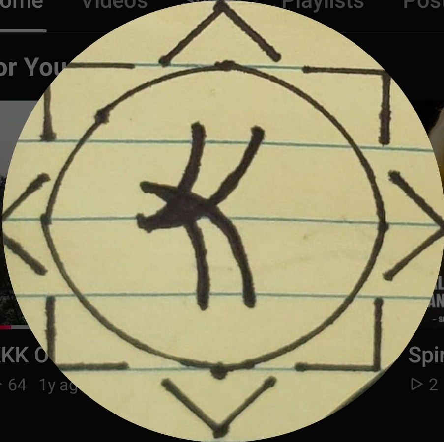

<!DOCTYPE html>
<html lang="en">
<head>
<meta charset="UTF-8">
<meta name="viewport" content="width=device-width, initial-scale=1.0">
<title>KUEL Conditioning — True Healing</title>
<link href="https://fonts.googleapis.com/css2?family=Cormorant+Garamond:ital,wght@0,400;0,500;0,600;1,400;1,600&family=DM+Sans:wght@300;400;500&display=swap" rel="stylesheet">

</head>
<body>

<!-- NAV -->
<nav>
  
KUEL Conditioning

  <ul class="nav-links">
    <li><a id="nav-home" class="active" onclick="showPage('home')">Home</a></li>
    <li><a id="nav-course" onclick="showPage('course')">The Course</a></li>
    <li><a id="nav-resources" onclick="showPage('resources')">Resources</a></li>
    <li><a id="nav-videos" onclick="showPage('videos')">Videos</a></li>
    <li><a id="nav-coach" onclick="showPage('coach')">Life Coach</a></li>
  </ul>
  
Life Coach

  <!-- Hamburger dropdown -->
  

    <button id="hamburger-btn" onclick="toggleDropdown()" aria-label="Menu" style="background:transparent;border:0.5px solid rgba(201,168,76,0.3);border-radius:var(--radius);width:38px;height:38px;display:flex;flex-direction:column;align-items:center;justify-content:center;gap:5px;cursor:pointer;padding:0;transition:border-color .2s;">
      
      
      
    </button>
    

      
Home

      
The Course

      
Resources

      
Videos

      
Life Coach

    

  

</nav>

<!-- ═══════════════ HOME PAGE ═══════════════ -->

  

    

    

      

        
      

    

    <h1>True <em>Healing</em> Starts Within</h1>
    
KUEL Conditioning is a non-profit spiritual coaching program helping individuals reconnect with themselves, resolve unmet needs, and discover lasting inner peace — across mind, body, and spirit.

  

  <section class="mission" id="mission">
    

      

        

          
Our Foundation

          
"Once people get their needs met, they will find a level of peace that prevents relapse into the mental disorder response to trauma."

          

        

        

          
Mission

          <h2 class="section-title">Helping People <em>Access</em> Their Own Capacity to Heal</h2>
          
We believe many psychological symptoms are signals guiding individuals toward unmet needs. By helping people reconnect to themselves, their values, and inner peace — lasting healing becomes not only possible, but inevitable.

        

      

    

  </section>

  <section id="pillars">
    

      
What We Work On

      <h2 class="section-title">The Three <em>Pillars</em></h2>
      

        
<h3>Body</h3>
BMI, nutrition, exercise, sleep, general living, and all physical needs that form the foundation of wellbeing.

        
<h3>Mind</h3>
Attention, focus, repetitive thought patterns, cognitive restructuring, and mental maintenance practices.

        
<h3>Spirit</h3>
Connection to self, others, and nature. Esteem, emotional intelligence, inner fortitude, and life energy.

      

    

  </section>

  <section class="cta-banner">
    

      
Ready to Begin?

      <h2 class="section-title">Your <em>Transformation</em> Starts Here</h2>
      
The KUEL A.I. Agent leverages the Human Hierarchy of Needs based on your self-assessment, then pulls your wants and goals so that it can give you specific advice to help you move towards your best life. The Agent has a hedonistic approach to happiness where it is important to make the most out of life without harming yourself or others.

      

        

          <a class="btn-primary" href="https://claude.ai/public/artifacts/df7873d5-05fc-41a1-adbc-8b7f41def6b2" target="_blank" rel="noopener">KUEL Life Coach ↗</a>
          (free claude.ai account required)
        

        
View Resources

      

    

  </section>

<!-- ═══════════════ COURSE PAGE ═══════════════ -->

  

    
The Program

    <h1 class="section-title" style="max-width:700px;margin:0 auto .75rem;">KUEL Konditioning Kourse <em>6-Week Transformation</em></h1>
    
A structured, deeply personal journey through self-assessment, shadow work, spiritual awakening, and lasting reset. Each week builds on the last — guiding you from where you are to where you're capable of being.

  

  <section>
    

      

        

Week 01
<h3>Introduction &amp; Assessment</h3><ul><li>Sign contracts &amp; expectations</li><li>Mind / Body / Spirit self-assessment</li><li>Goal &amp; intention setting</li><li>Journaling &amp; reflection routines</li></ul>

        

Week 02
<h3>Shadow Work</h3><ul><li>Identify triggers &amp; habitual responses</li><li>Cognitive Behavioral Therapy tools</li><li>7-step problem-solving process</li><li>Esteem, boundaries &amp; mantra writing</li></ul>

        

Week 03
<h3>Wakening &amp; Spiritual Warfare</h3><ul><li>Deep dive into the psyche</li><li>Brain waves &amp; perception</li><li>Art of War principles</li><li>Law of Attraction</li></ul>

        

Week 04
<h3>Calcination &amp; Resetting</h3><ul><li>Remaking the soul</li><li>Cognitive restructuring</li><li>The Way — philosophical framework</li><li>Support team &amp; safety planning</li></ul>

        

Week 05
<h3>Detox &amp; Nature</h3><ul><li>Energy, vibration &amp; frequency</li><li>Fasting &amp; alkaline nutrition</li><li>Nature immersion &amp; grounding</li><li>Mushroom Therapy experience</li></ul>

        

Week 06
<h3>Test &amp; Evaluate</h3><ul><li>Integration &amp; reflection</li><li>Evaluate at Day 2, 7, 30, 90, 180, 360</li><li>Re-assess needs &amp; reset goals</li><li>Schedule ongoing follow-ups</li></ul>

      

      

        <a class="btn-primary" href="mailto:kuelconditioning@gmail.com">Enroll Today</a>
        
View Resources ↗

      

    

  </section>

<!-- ═══════════════ RESOURCES PAGE ═══════════════ -->

  

    
DIY Toolkit

    <h1 class="section-title" style="max-width:700px;margin:0 auto .75rem;">Course <em>Resources</em> &amp; Documents</h1>
    
All contracts, worksheets, outlines, and lesson materials for the KUEL Konditioning Kourse. Fill out documents directly on this page and print with your answers.

  

  <section>
    

      <!-- FEATURED DOCS 1, 2, 3 -->
      
Start Here — Fill Out &amp; Print

      <h2 class="section-title">Required <em>Agreements</em> &amp; Foundational Texts</h2>
      
Click "Open &amp; Fill" to complete these documents right here on the website. Type your answers in the fields and print — your answers will appear on the printed copy.

      

        <!-- DOC 1 -->
        

          
✦ Featured · Week 1

          

            <h3>Kode of Konduct Kontract</h3>
            
The foundational agreement between Coach and Client outlining ethical principles, responsibilities, boundaries, and expectations for the coaching relationship.

            

              <button class="doc-open-btn" onclick="openModal('doc1')">✏ Open &amp; Fill</button>
              <a class="doc-link-btn" href="https://docs.google.com/document/d/1czaUrZSoh7TwyFKOPuIRtSbNULMQ3e6slJgXwVdQAO0/edit" target="_blank">Open in Drive ↗</a>
            

          

        

        <!-- DOC 2 -->
        

          
✦ Featured · Week 1

          

            <h3>Confidentiality Agreement</h3>
            
A formal agreement ensuring all personal, emotional, spiritual, and psychological information shared during coaching sessions remains strictly confidential.

            

              <button class="doc-open-btn" onclick="openModal('doc2')">✏ Open &amp; Fill</button>
              <a class="doc-link-btn" href="https://docs.google.com/document/d/1JQe7wBe4IEqbAswqbKK5gS8Mk1L4Bo2GsxLK2el3CeY/edit" target="_blank">Open in Drive ↗</a>
            

          

        

        <!-- DOC 3 (Needs-Goals) -->
        

          
✦ Featured · Week 1

          

            <h3>Needs Assessment &amp; Goal Setting</h3>
            
Maslow's hierarchy self-assessment — score each need 1–10, identify gaps, then set daily, monthly, yearly &amp; long-term goals to manifest your best life.

            

              <button class="doc-open-btn" onclick="openModal('doc4')">✏ Open &amp; Fill</button>
              <a class="doc-link-btn" href="https://drive.google.com/file/d/1vsRHALVx3J_lJWnPNAvaYBJa1po3kdmP/view" target="_blank">Open in Drive ↗</a>
            

          

        

      

      <!-- DOCS 3 & 5-10 -->
      

        

          

            
<h4>The Way</h4>
Musashi's 9 principles, philosophical frameworks from Buddha, Confucius, and Plato — foundational wisdom for Week 4

            

              <a class="resource-link" href="https://youtu.be/cUDA6tXtzbw?si=hBIHiN3RnHBkh82H" target="_blank" style="flex-direction:column;align-items:center;gap:2px;padding:8px 14px;">OpenVideo</a>
              <a class="resource-link" href="https://docs.google.com/document/d/1bAWWlb6sSPKD279LLPwjHJJhGA_2mmiBhNyLILMtL04/edit" target="_blank" style="flex-direction:column;align-items:center;gap:2px;padding:8px 14px;">OpenOutline</a>
            

          

          

            
<h4>Finding Your Soul</h4>
Journaling techniques, the soul across religious &amp; philosophical traditions, remaking &amp; renewing the soul

            

              <a class="resource-link" href="https://youtu.be/SsYwEa26uus?si=4VvCaO4DdbGHpo7o" target="_blank" style="flex-direction:column;align-items:center;gap:2px;padding:8px 14px;">OpenVideo</a>
              <a class="resource-link" href="https://docs.google.com/document/d/1F4O8932BXA4iUeCoN7N2CeCNA64ufqJ_4iUPIdb0Lto/edit" target="_blank" style="flex-direction:column;align-items:center;gap:2px;padding:8px 14px;">OpenOutline</a>
            

          

          

            
<h4>Spiritual Warfare</h4>
Universal Laws of Vibration &amp; Energy, manipulation vs alignment, good vs bad energy dynamics

            

              <a class="resource-link" href="https://youtu.be/HgGzTxEI7zc?si=W00BdS0AqLeihla_" target="_blank" style="flex-direction:column;align-items:center;gap:2px;padding:8px 14px;">OpenVideo</a>
              <a class="resource-link" href="https://docs.google.com/document/d/1bWj3Yy9JS2kWdG-mr7B60GvRE9YyCB6ov_JoZMTYv9s/edit" target="_blank" style="flex-direction:column;align-items:center;gap:2px;padding:8px 14px;">OpenOutline</a>
            

          

          

            
<h4>Spiritual Warfare (Dark Psychology)</h4>
Dark psychology techniques, manipulation in relationships, cognitive-behavioral protection strategies

            <a class="resource-link" href="https://docs.google.com/document/d/1A6QtvsVdVdodq5U8AdS4rkTn0Xz9iT7vt5WINsOYdv0/edit" target="_blank" style="flex-direction:column;align-items:center;gap:2px;padding:8px 14px;">OpenNotes</a>
          

          

            
<h4>Journaling</h4>
Types of journaling, goal-setting journal templates, visualization techniques for focus &amp; accountability

            <a class="resource-link" href="https://docs.google.com/document/d/1FabR3Wq3YNLz77v4y1BeR55FFTLTPfwELDbF1rTxaS0/edit" target="_blank" style="flex-direction:column;align-items:center;gap:2px;padding:8px 14px;">OpenNotes</a>
          

          

            
<h4>Nutrition</h4>
Alkaline diet principles, food pH science, fasting protocols, nutrition lesson plan for Week 5

            <a class="resource-link" href="https://docs.google.com/document/d/1SNsy-TddZl7z1ZEUBB5fWAivo5YgPBCfPzuk6BMNdQM/edit" target="_blank" style="flex-direction:column;align-items:center;gap:2px;padding:8px 14px;">OpenNotes</a>
          

          

            
<h4>Power</h4>
The Art of War &amp; spiritual warfare, Sun Tzu's principles applied to inner battles, strategy &amp; discernment

            <a class="resource-link" href="https://docs.google.com/document/d/10s8_Lx_pq6pSUddy2X8eagO0ipqTonxfkh_jma1QumQ/edit" target="_blank" style="flex-direction:column;align-items:center;gap:2px;padding:8px 14px;">OpenNotes</a>
          

          

            
<h4>Self-Care</h4>
50 self-care practices across physical, emotional, mental, social, and spiritual dimensions of wellness

            <a class="resource-link" href="https://docs.google.com/document/d/1WyqGHhx80-HcZFWuROxm4NFDCoDVZo_YusUPRnDB1vk/edit" target="_blank" style="flex-direction:column;align-items:center;gap:2px;padding:8px 14px;">OpenNotes</a>
          

          

            
<h4>Mushies</h4>
KKK legal, medical, and other practical business framework with A2 and Ypsi's formal Resolutions.

            <a class="resource-link" href="https://drive.google.com/drive/folders/1ZDAthi6E4MSrvI1TSedMSlbuMVX6W3Po" target="_blank" style="flex-direction:column;align-items:center;gap:2px;padding:8px 14px;">OpenNotes</a>
          

        

      

    

  </section>

<!-- ═══════════════ VIDEOS PAGE ═══════════════ -->

  

    
Media

    <h1 class="section-title" style="max-width:600px;margin:0 auto 1rem;">KUEL Konditioning Kourse <em>Video Library</em></h1>
    
Explore our full video series — teachings on true healing, spiritual conditioning, and the transformative practices at the heart of the course.

  

  <section>
    

      

          

            

              <iframe width="100%" height="100%" src="https://www.youtube.com/embed/cKK12aczfvc?list=PLQY9UNiB9VdWiDhiZUnNiGYkGmZMGMDGC?rel=0&modestbranding=1" title="KKK Overview" allowfullscreen allow="accelerometer; autoplay; clipboard-write; encrypted-media; gyroscope; picture-in-picture" style="display:block;border:none;"></iframe>
            

            

              
KKK Overview

              
Overview of 6-week spiritual coaching program designed to help people improve their lives through self-assessment, shadow work, mindset shifts, spiritual exploration, and lifestyle changes. Participants move through weekly themes—from goal setting and cognitive tools to detox, nature immersion, and long-term reflection—with the aim of resolving unmet needs, building inner peace, and creating lasting personal transformation.

            

          

          

            

              <iframe width="100%" height="100%" src="https://www.youtube.com/embed/2xXozhSFoRI?rel=0&modestbranding=1" title="Needs Assessment &amp; Goal Setting" allowfullscreen allow="accelerometer; autoplay; clipboard-write; encrypted-media; gyroscope; picture-in-picture" style="display:block;border:none;"></iframe>
            

            

              
Needs Assessment &amp; Goal Setting

              
Helps identify which foundational areas of life—such as physical health, safety, relationships, esteem, and purpose—may be underdeveloped, allowing you to focus energy on what is most likely to improve your well-being and stability. Goal setting then turns that awareness into action by creating a clear path toward growth, helping you build habits, track progress, and intentionally move toward the life you want.

            

          

          

            

              <iframe width="100%" height="100%" src="https://www.youtube.com/embed/cUDA6tXtzbw?rel=0&modestbranding=1" title="The Way" allowfullscreen allow="accelerometer; autoplay; clipboard-write; encrypted-media; gyroscope; picture-in-picture" style="display:block;border:none;"></iframe>
            

            

              
The Way

              
Drawing from Musashi's 9 Principles, the 10 Abilities, and the 7 Arts, this lesson explores what it means to master not just a skill but an entire way of living. Weaving together the philosophies of Confucius, Buddha, and Plato, it challenges you to live honestly, train relentlessly, and see what others cannot — turning strategy and wisdom into a daily spiritual practice.

            

          

          

            

              <iframe width="100%" height="100%" src="https://www.youtube.com/embed/SsYwEa26uus?rel=0&modestbranding=1" title="Finding Your Soul" allowfullscreen allow="accelerometer; autoplay; clipboard-write; encrypted-media; gyroscope; picture-in-picture" style="display:block;border:none;"></iframe>
            

            

              
Finding Your Soul

              
This lesson dives into the soul — what it is across religion, philosophy, and psychology — and how to begin the process of remaking it. Through journaling, shadow work, and the principles of spiritual alchemy, you'll learn how to confront suppressed emotions, release past wounds, and reconnect with your authentic self. It also explores the role of psilocybin as a catalyst for deep inner transformation when used with intention and care.

            

          

          

            

              <iframe width="100%" height="100%" src="https://www.youtube.com/embed/Zdgl4d-jYt8?rel=0&modestbranding=1" title="Mushroom Intro" allowfullscreen allow="accelerometer; autoplay; clipboard-write; encrypted-media; gyroscope; picture-in-picture" style="display:block;border:none;"></iframe>
            

            

              
Mushroom Intro

              
Intro to psychedelic mushrooms with a quick overview of a study of the health risks and benefits of psilocybin for depression in terminal patients.

            

          

          

            

              <iframe width="100%" height="100%" src="https://www.youtube.com/embed/HgGzTxEI7zc?rel=0&modestbranding=1" title="Spiritual Warfare" allowfullscreen allow="accelerometer; autoplay; clipboard-write; encrypted-media; gyroscope; picture-in-picture" style="display:block;border:none;"></iframe>
            

            

              
Spiritual Warfare

              
An unflinching look at the unseen battle of energies, intentions, and influence that shape your reality every day. This lesson covers the Universal Laws of Vibration, Karma, Attraction, and Divine Oneness alongside the dark side — manipulation, NLP, gaslighting, the Dark Triad, and The Art of War. Understanding both sides of this warfare is the first step to protecting your energy, raising your vibration, and refusing to be a pawn in someone else's game.

            

          

      

    

  </section>

<!-- ═══════════════ LIFE COACH PAGE ═══════════════ -->

  

    
AI-Powered Guidance

    <h1 class="section-title" style="max-width:700px;margin:0 auto .75rem;">KUEL <em>Life Coach</em></h1>
    
Your personal AI life coach — powered by Maslow's Hierarchy of Needs, hedonistic philosophy, and practical goal-setting to help you build your best life.

    

      <a class="btn-primary" href="https://claude.ai/public/artifacts/df7873d5-05fc-41a1-adbc-8b7f41def6b2" target="_blank" rel="noopener" style="font-size:14px;padding:14px 36px;">Launch KUEL Life Coach ↗</a>
      (free claude.ai account required)
    

  

  <section>
    

      <!-- What it is -->
      

        
What It Is

        <h2 class="section-title">Your Personal <em>AI Guide</em></h2>
        
The KUEL Life Coach is an AI agent that leverages Maslow's Human Hierarchy of Needs alongside your personal self-assessment, wants, and goals to deliver specific, personalized advice for moving toward your best life.

         
        
It takes a <em style="color:var(--gold);">hedonistic approach to happiness</em> — helping you make the most out of life in ways that lift you up without harming yourself or others.

         
        

          

            
📋

            
Needs Assessment

            
Score yourself across all five levels of Maslow's hierarchy — physical, security, belonging, esteem, and self-actualization — to reveal exactly where your growth opportunities lie.

          

          

            
🎯

            
Goal Setting

            
Define your dreams, long-term targets, short-term milestones, and daily habits. The coach uses everything you share to build a plan tailored specifically to you.

          

        

      

      <!-- Features highlight -->
      

        
What You'll Receive

        

          

            📅
            

              
Calendar & Phone Integration

              
Specific tips for Google Calendar, Apple Calendar, phone alarms, and habit-tracking apps — built around your actual goals.

            

          

          

            ⏰
            

              
Scheduled Hour Blocks

              
Dedicated time blocks for each goal with a curated list of ideas on how to achieve greatness during each session.

            

          

          

            🎯
            

              
Short-Term → Long-Term Roadmap

              
Each short-term goal is connected to a long-term target with concrete actions, a timeframe, and a clear success metric.

            

          

          

            💬
            

              
Personal AI Coaching Chat

              
An ongoing conversation that knows your needs, goals, and plan — ready to help you push through obstacles and stay on track.

            

          

        

      

      <!-- CTA -->
      

        
Ready to Begin?

        <h2 class="section-title" style="text-align:center;margin-bottom:1rem;">Start Your <em>Journey</em> Today</h2>
        

          <a class="btn-primary" href="https://claude.ai/public/artifacts/df7873d5-05fc-41a1-adbc-8b7f41def6b2" target="_blank" rel="noopener" style="font-size:14px;padding:14px 40px;">Launch KUEL Life Coach ↗</a>
          (free claude.ai account required)
        

      

    

  </section>

<!-- FOOTER -->
<footer>
  
KUEL Conditioning

  <ul class="footer-links">
    <li><a onclick="showPage('home')">Home</a></li>
    <li><a onclick="showPage('course')">The Course</a></li>
    <li><a onclick="showPage('resources')">Resources</a></li>
    <li><a onclick="showPage('videos')">Videos</a></li>
    <li><a onclick="showPage('coach')">Life Coach</a></li>
  </ul>
  
© 2025 KUEL Conditioning kuelconditioning@gmail.com

</footer>

<!-- ═══════════════ DOC MODALS ═══════════════ -->

<!-- MODAL: Doc 1 - Kode of Konduct -->

  

    

      Document 1 — Kode of Konduct Kontract
      

        <button class="modal-print-btn" onclick="printModal('modal-doc1')">🖨 Print with Answers</button>
        <button class="modal-close-btn" onclick="closeModal('modal-doc1')">✕</button>
      

    

    

      
Kode of Konduct Kontract

      
KUEL Conditioning — Fill in all fields below, then print

      
This Code of Conduct Contract is an agreement between <input class="doc-fill-field wide" placeholder="Spiritual Coach's Name" /> (the "Coach") and <input class="doc-fill-field wide" placeholder="Client's Name" /> (the "Client").

      
1. Purpose

      
The purpose of this Code of Conduct is to establish the ethical guidelines and professional standards that will govern the coaching relationship between the Coach and the Client.

      
2. Ethical Principles

      
The Coach and Client agree to adhere to the following ethical principles:

      
Respect: Treat one another with dignity, respect, and compassion, regardless of their background, beliefs, or circumstances.

      
Confidentiality: Maintain strict confidentiality of all information provided, except with explicit consent outlined in the Confidentiality Agreement.

      
Integrity: Act with honesty, integrity, and transparency in all professional dealings.

      
Beneficence: The Coach will work to promote the well-being of the Client and avoid causing harm.

      
Dual Relationships: The Coach will avoid dual relationships with the Client that could compromise professional judgment.

      
Power Dynamics: Be mindful of the power dynamics in the coaching relationship and avoid exploiting the Client.

      
Conflict of Interest: Disclose any potential conflicts of interest that could affect the coaching relationship.

      
3. Client Responsibilities

      
The Client agrees to:

      
Respect for the Coach: Treat the Coach with dignity, respect, and compassion.

      
Openness and Honesty: Communicate openly and honestly with the Coach, sharing relevant information and feelings. The goal is to see yourself clearly.

      
Active Participation: Actively participate in the coaching process, taking responsibility for their own growth and development.

      
Substance Use: Fast from mind and body altering substances during designated times that could impair judgment or ability to benefit from the coaching process.

      
Respect for Boundaries: Respect the boundaries established by the Coach, both professionally and personally.

      
Scheduling: Respect the Coach's time and make every effort to arrive on time for scheduled sessions.

      
Cancellation Policy: Follow the Coach's cancellation policy and provide timely notice if rescheduling or cancelling.

      
4. Termination

      
Either party may terminate the coaching relationship at any time. The Coach will terminate the coaching relationship when it is no longer beneficial or appropriate.

      
5. Amendments

      
This Code of Conduct may be amended in writing by mutual agreement of both parties.

      
By signing below, the Coach and the Client acknowledge that they have read, understood, and agreed to the terms of this Code of Conduct.

      

        

          

          <label>Coach's Signature</label>
          <input placeholder="Coach's Full Name" />
          <input type="date" style="margin-top:8px;" />
        

        

          

          <label>Client's Signature</label>
          <input placeholder="Client's Full Name" />
          <input type="date" style="margin-top:8px;" />
        

      

    

  

<!-- MODAL: Doc 2 - Confidentiality Agreement -->

  

    

      Document 2 — Confidentiality Agreement
      

        <button class="modal-print-btn" onclick="printModal('modal-doc2')">🖨 Print with Answers</button>
        <button class="modal-close-btn" onclick="closeModal('modal-doc2')">✕</button>
      

    

    

      
Confidentiality Agreement

      
KUEL Conditioning — Fill in all fields below, then print

      
This Confidentiality Agreement ("Agreement") is made and entered into on this <input class="doc-fill-field short" placeholder="day" /> day of <input class="doc-fill-field" placeholder="Month" />, 20<input class="doc-fill-field short" placeholder="YY" />, by and between:

      
<input class="doc-fill-field wide" placeholder="Coach's Full Name" />, a professional Spirituality Coach, having their principal place of business at <input class="doc-fill-field wide" placeholder="Business Address" />, hereinafter referred to as the "Coach," and

      
<input class="doc-fill-field wide" placeholder="Client's Full Name" />, residing at <input class="doc-fill-field wide" placeholder="Client's Address" />, hereinafter referred to as the "Client."

      
1. Purpose

      
The purpose of this Agreement is to ensure that all information disclosed by the Client to the Coach during the coaching relationship, whether verbal, written, or in any other form, will be kept confidential and used solely for the benefit of the Client within the professional coaching relationship.

      
2. Confidential Information

      
"Confidential Information" means any personal, emotional, spiritual, or psychological information disclosed by the Client during coaching sessions. This includes discussions regarding the Client's spiritual beliefs, personal development goals, life experiences, and any materials shared by the Client that are not publicly known or available.

      
3. Obligations of the Coach

      
The Coach agrees to:

      
Maintain the strict confidentiality of all Confidential Information shared by the Client.

      
Not disclose any Confidential Information to any third party without the prior written consent of the Client, except as required by law.

      
Use Confidential Information solely for the purpose of providing professional spiritual coaching services to the Client.

      
4. Exceptions to Confidentiality

      
This Agreement does not apply to information that:

      
Is or becomes publicly available through no fault of the Coach.

      
Is disclosed with the prior written consent of the Client.

      
Is required to be disclosed by law, court order, or governmental regulation.

      
5. Term of Confidentiality

      
The confidentiality obligations will remain in effect for the duration of the coaching relationship and continue indefinitely after termination of coaching services, unless otherwise specified by law.

      
6. Breach of Agreement

      
In the event of a breach of this Agreement by the Coach, the Client may pursue any legal or equitable remedies available, including injunctive relief.

      
7. Termination

      
Either party may terminate this Agreement with prior written notice. Termination does not release the Coach from confidentiality obligations regarding information disclosed during the term of the Agreement.

      
8. Governing Law

      
This Agreement shall be governed by and construed in accordance with the laws of the state of <input class="doc-fill-field" placeholder="State" />, without regard to its conflict of law principles.

      
9. Entire Agreement

      
This Agreement constitutes the entire understanding between the parties with respect to the subject matter hereof and supersedes all prior discussions, agreements, or understandings of any kind.

      
IN WITNESS WHEREOF, the parties hereto have executed this Confidentiality Agreement as of the date first above written.

      

        

          

          <label>Coach's Signature</label>
          <input placeholder="Coach's Full Name" />
          <input type="date" style="margin-top:8px;" />
        

        

          

          <label>Client's Signature</label>
          <input placeholder="Client's Full Name" />
          <input type="date" style="margin-top:8px;" />
        

      

    

  

<!-- MODAL: Doc 4 - Needs Assessment & Goal Setting -->

  

    

      Document 4 — Needs Assessment &amp; Goal Setting
      

        <button class="modal-print-btn" onclick="printModal('modal-doc4')">🖨 Print with Answers</button>
        <button class="modal-close-btn" onclick="closeModal('modal-doc4')">✕</button>
      

    

    

      
Needs Assessment

      
KUEL Conditioning · Score each need 1–10, then build your goals below

      
Maslow's hierarchy of needs suggests people are motivated to fulfill fundamental needs in a hierarchical order — starting with basic physiological and safety needs before moving to higher-level needs for belonging, esteem, and self-actualization.

      
How well are you meeting these needs? Score each 1–10.

      

        

          
Physical Needs

          
Overall Score: <input class="doc-fill-field short" placeholder="1–10" />

          

            
Breathing<input class="doc-fill-field short" placeholder="1–10" style="min-width:60px;text-align:center;" />

            
Water<input class="doc-fill-field short" placeholder="1–10" style="min-width:60px;text-align:center;" />

            
Food<input class="doc-fill-field short" placeholder="1–10" style="min-width:60px;text-align:center;" />

            
Sleep<input class="doc-fill-field short" placeholder="1–10" style="min-width:60px;text-align:center;" />

            
Clothing<input class="doc-fill-field short" placeholder="1–10" style="min-width:60px;text-align:center;" />

            
Shelter<input class="doc-fill-field short" placeholder="1–10" style="min-width:60px;text-align:center;" />

          

        

        

          
Security Needs

          
Overall Score: <input class="doc-fill-field short" placeholder="1–10" />

          

            
Health<input class="doc-fill-field short" placeholder="1–10" style="min-width:60px;text-align:center;" />

            
Personal Safety<input class="doc-fill-field short" placeholder="1–10" style="min-width:60px;text-align:center;" />

            
Employment<input class="doc-fill-field short" placeholder="1–10" style="min-width:60px;text-align:center;" />

            
Property<input class="doc-fill-field short" placeholder="1–10" style="min-width:60px;text-align:center;" />

            
Resources<input class="doc-fill-field short" placeholder="1–10" style="min-width:60px;text-align:center;" />

          

        

        

          
Belonging Needs

          
Overall Score: <input class="doc-fill-field short" placeholder="1–10" />

          

            
Friendship<input class="doc-fill-field short" placeholder="1–10" style="min-width:60px;text-align:center;" />

            
Family<input class="doc-fill-field short" placeholder="1–10" style="min-width:60px;text-align:center;" />

            
Community<input class="doc-fill-field short" placeholder="1–10" style="min-width:60px;text-align:center;" />

            
Intimacy<input class="doc-fill-field short" placeholder="1–10" style="min-width:60px;text-align:center;" />

            
Sense of Connection<input class="doc-fill-field short" placeholder="1–10" style="min-width:60px;text-align:center;" />

          

        

        

          
Esteem Needs

          
Overall Score: <input class="doc-fill-field short" placeholder="1–10" />

          

            
Achievements<input class="doc-fill-field short" placeholder="1–10" style="min-width:60px;text-align:center;" />

            
Self-Respect<input class="doc-fill-field short" placeholder="1–10" style="min-width:60px;text-align:center;" />

            
External Admiration<input class="doc-fill-field short" placeholder="1–10" style="min-width:60px;text-align:center;" />

            
Strength<input class="doc-fill-field short" placeholder="1–10" style="min-width:60px;text-align:center;" />

            
Confidence<input class="doc-fill-field short" placeholder="1–10" style="min-width:60px;text-align:center;" />

            
Freedom<input class="doc-fill-field short" placeholder="1–10" style="min-width:60px;text-align:center;" />

          

        

        

          
Self-Actualization

          
Overall Score: <input class="doc-fill-field short" placeholder="1–10" />

          

            
Morality<input class="doc-fill-field short" placeholder="1–10" style="min-width:60px;text-align:center;" />

            
Acceptance<input class="doc-fill-field short" placeholder="1–10" style="min-width:60px;text-align:center;" />

            
Creativity<input class="doc-fill-field short" placeholder="1–10" style="min-width:60px;text-align:center;" />

            
Find Meaning in Life<input class="doc-fill-field short" placeholder="1–10" style="min-width:60px;text-align:center;" />

            
Live with Purpose<input class="doc-fill-field short" placeholder="1–10" style="min-width:60px;text-align:center;" />

            
Being Present<input class="doc-fill-field short" placeholder="1–10" style="min-width:60px;text-align:center;" />

            
Realize Fullest Potential<input class="doc-fill-field short" placeholder="1–10" style="min-width:60px;text-align:center;" />

          

        

      

      
If any of these fall below a 7 they can potentially be the cause of physical or emotional distress. Once you identify gaps, create a plan to ensure all your needs get met on the path to lasting happiness.

      
Areas to Improve (scores below 7)

      <textarea placeholder="List the needs where you scored below 7 and briefly describe why..." style="width:100%;min-height:70px;border:1.5px solid #c9a84c;border-radius:3px;padding:8px;resize:vertical;font-family:'DM Sans',sans-serif;font-size:13px;color:#1a1a1a;background:rgba(201,168,76,.04);outline:none;"></textarea>

      
Goal Setting

      
Goals should help meet your needs, improve yourself, and elevate your community. Set 3 or more goals for each timeframe below.

      
Dreams to Manifest

      
Visions of your best life to create in reality.

      <textarea placeholder="Write your dreams and visions here..." style="width:100%;min-height:80px;border:1.5px solid #c9a84c;border-radius:3px;padding:8px;resize:vertical;font-family:'DM Sans',sans-serif;font-size:13px;color:#1a1a1a;background:rgba(201,168,76,.04);outline:none;"></textarea>

      
Long Term Goals

      
Goals to add to shorter term goals in due time.

      <textarea placeholder="1. &#10;2. &#10;3. " style="width:100%;min-height:80px;border:1.5px solid #c9a84c;border-radius:3px;padding:8px;resize:vertical;font-family:'DM Sans',sans-serif;font-size:13px;color:#1a1a1a;background:rgba(201,168,76,.04);outline:none;"></textarea>

      
Short Term Goals

      
Prioritize what you must or might complete in the near future.

      <textarea placeholder="1. &#10;2. &#10;3. " style="width:100%;min-height:80px;border:1.5px solid #c9a84c;border-radius:3px;padding:8px;resize:vertical;font-family:'DM Sans',sans-serif;font-size:13px;color:#1a1a1a;background:rgba(201,168,76,.04);outline:none;"></textarea>

      
Daily Tasks

      
Better your quality of life through responsibility to self and community. Reset daily.

      <textarea placeholder="1. &#10;2. &#10;3. " style="width:100%;min-height:80px;border:1.5px solid #c9a84c;border-radius:3px;padding:8px;resize:vertical;font-family:'DM Sans',sans-serif;font-size:13px;color:#1a1a1a;background:rgba(201,168,76,.04);outline:none;"></textarea>

      

        Name:
        <input class="doc-fill-field" placeholder="Your name" style="flex:1;" />
        Date:
        <input type="date" class="doc-fill-field" style="flex:1;" />
      

    

  

</body>
</html>
